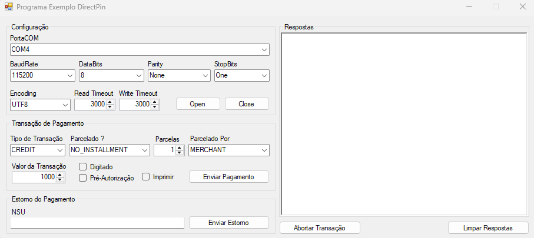

<h1 align="center">Programa Exemplo DemoDirectPin</h1>

<p align="center">
  Projeto de demonstração utilizando <b>Linguagem C#</b> para comunicação direta com o <b>Pinpad Android (PAX - A35)</b> baseado na solução <b>DirectPIN</b>, realizando transação e estorno da transação, seguindo a especificação na documentação oficial.
</p>

<p align="center">
  
</p>

## Objetivo
Demonstrar a integração direta entre uma aplicação e o **Pinpad Android (PAX - A35)**, utilizando comunicação serial e protocolo definido pela Transire, sem dependência de bibliotecas externas.

<h2>Classes Implementadas na pasta <b>DirectPin</b></h2>

<table>
  <tr>
    <th>Classes</th>
    <th>Descrição</th>
  </tr>
  <tr>
    <td><b>DpPayloadRequestTransaction.cs</b></td>
    <td>Representa a estrutura de dados de uma requisição de transação no DirectPIN. Usada para serializar e desserializar informações de transações em JSON.</td>
  </tr>
  <tr>
    <td><b>DpPayloadRequestReversal.cs</b></td>
    <td>Representa uma requisição de cancelamento de transação no DirectPIN. Usada para serializar e desserializar informações de estorno em JSON.</td>
  </tr>
  <tr>
    <td><b>DpPayloadResponseTransaction.cs</b></td>
    <td>Representa a resposta de uma transação no DirectPIN. Usada para interpretar os dados retornados após uma operação de pagamento.</td>
  </tr>
  <tr>
    <td><b>DpPayloadResponseReversal.cs</b></td>
    <td>Representa a resposta de um cancelamento de transação no DirectPIN. Usada para interpretar os dados retornados após uma reversão.</td>
  </tr>
  <tr>
    <td><b>Enums</b> (<b>DpTypeTransaction.cs, DpCreditType.cs, DpInterestType.cs</b>)</td>
    <td>Representam os tipos de transações, tipos de crédito e tipos de juros, ajudando a evitar erros de digitação e facilitando a validação.</td>
  </tr>
  <tr>
    <td><b>Mappers.cs</b></td>
    <td>Classe utilitária estática que converte enums ↔ strings, facilitando a interoperabilidade entre aplicação e JSON/APIs.</td>
  </tr>
  <tr>
    <td><b>Utils.cs</b></td>
    <td>Classe utilitária estática com métodos auxiliares: cálculo de CRC, conversão para hexadecimal e codificação/decodificação Base64.</td>
  </tr>
</table>

## Funcionalidades Implementadas
- Envio de transações de pagamento (crédito, débito, estorno).
- Comunicação serial com o Pinpad Android (PAX - A35) via porta COM.
- Encapsulamento de mensagens com protocolo DirectPIN.
- Cálculo de CRC-16-CCITT para verificação de integridade.
- Decodificação de mensagens em Base64.
- Geração de logs detalhados das transações.

## Tecnologias Utilizadas
- C# (.NET Framework 4.8)
- Comunicação Serial
- Codificação Base64
- Algoritmo CRC-16-CCITT

## Como Executar
- Abra o projeto no Visual Studio.
- Compile e execute a aplicação.
- Configure a porta COM no formulário principal.
- Realize testes de transações com o Pinpad Android (PAX - A35) conectado.

## Estrutura da Mensagem Serial

| Campo       | Descrição                                      | Tamanho   |
|-------------|------------------------------------------------|-----------|
| `SYN`       | Byte de início da mensagem (`0x16`)            | 1 byte    |
| `Payload`   | JSON convertido para Base64                    | variável  |
| `Checksum`  | CRC-16-CCITT calculado sobre o Payload         | 2 bytes   |
| `ETB`       | Byte de término da mensagem (`0x17`)           | 1 byte    |

## Exemplo de Payload da Transação
```json
{
  "type": "transaction",
  "amount": 1000,
  "typeTransaction": "CREDIT",
  "creditType": "NO_INSTALLMENT",
  "installment": 1,
  "isTyped": false,
  "isPreAuth": false,
  "interestType": "MERCHANT",
  "printReceipt": false
}
```
## Exemplo de Resposta Transação
```json
{
  "type": "TRANSACTION",
  "result": true,
  "message": "Transação aprovada",
  "amount": 1000,
  "nsu": "17557121803052335",
  "nsuAcquirer": "810488",
  "panMasked": "524831******3676",
  "date": 1755700126088,
  "typeCard": "CONTACTLESS_EMV",
  "finalResult": "APPROVED",
  "codeResult": 0,
  "receiptContent": "@ TECTOY @ VENDA A CREDITO ..."
}
```
## Exemplo de Payload Cancelamento
```json
{
  "type": "cancelTransaction",
  "nsu": "17557121803052335",
}
```
## Exemplo de resposta do Cancelamento
```json
{
   "message":"Transação cancelada com sucesso",
   "receiptContent":"@        MASTERCARD                 @        CANCELAMENTO DE TRANSACAO",
   "result":true,
   "type":"CANCELLATION"
}
```

